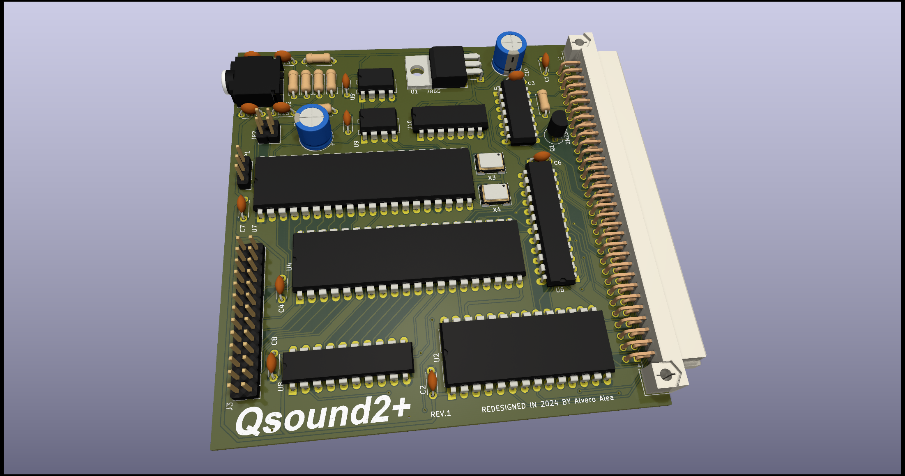

#Sinclair QL Qsound2+
## Soundcard compatible with QsoundQprint for Sinclair QL

(C) 2024 Alvaro Alea Fernandez

License under: CERN Open Hardware Licence Version 2 - Strongly Reciprocal

https://ohwr.org/cern_ohl_s_v2.txt

I upgrade the original desing:

- Using a YM2203, compatible with AY-3-8910 but add a FM sound Chanel
- Add a second way to access the chip, without the PIA (MC6821) to speedup the access.
- Fixed 2Mhz clock, same that Atari ST
- Stereo Output (ABC or ACB selectable by jumpers)

- Remain compatible with Qsound (include a jumper to select internal clock reference as in Qsound)

This project can not be possible without the help of silvester, that tracked a fault in the schematic and Marcel Kilgus that develop a new ROM with a qsound device and a pt3 player.

I test with ROM versions 1.10, 1.31 and 1.40 and work as expected, new ROM do not have the printer routines, but have a new options used by the pt3 player. 

You can use a 2764 eprom or a W27C512 flash, that is much more cheap and easy to use.

This board user the default Motorola 68K inteface as described in the documentation of AY-3-8910 PSG. with a 6821 PIA as a glue between the QL and the PSG, in the info folder you can found aditional information about this chips or the interface.

The card have full 8bit I/O in the PSG without use, and another 8 bits in the PIA, also the pins of the paralel port are directly wired to the PSG, and are bidirectional, so can be used for other propouses.

The board use the E signal as a clock for the PSG, this cause that the PSG work in a very low frecuency, below the minimun indicated in the datasheet, and also this cause that tunes from Spectrum or other systems, can not be directly converted.

 

 

## TEchnical details:
The Card reserve 16Kb of Memory space following Sinclair's P'N'P Way, this mean that is not compatible with 768Kb Trump Card, and that in most of the QL will end on the 0xC0000 - 0xC3FFFF.

The first 8Kb are occuped by the ROM

The next  4Kb are occuped by the MC6821 like in normal QSound

The last 4Kb are used for direct access to the YM2203, it use also A1, so there are two directions:

Write 0xC3000 ->  Write Address Register

Read  0xC3000 -> Read Read Status

Write 0xC3002 -> Write Register Value

Read  0xC3002 -> Read Read Register Value

There is no way to know which Clock is selected or Stereo type, this is handmade selections.

