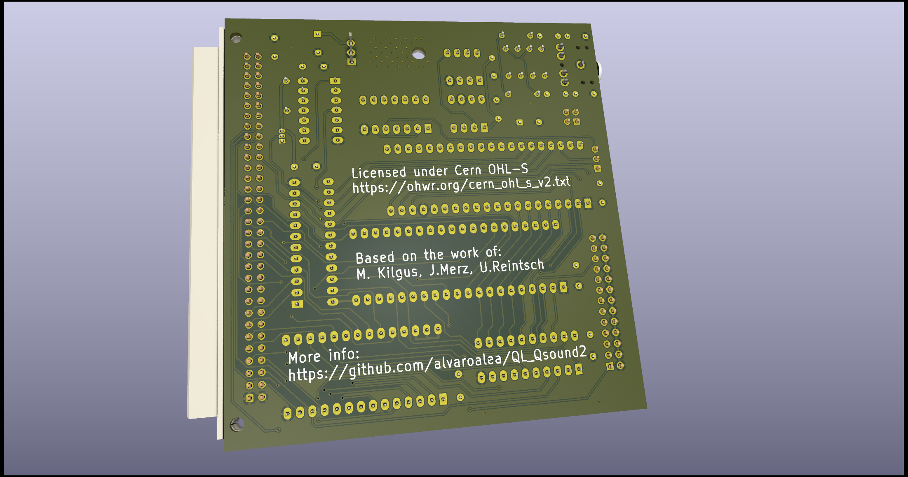

# Sinclair QL Qsound2+
## Soundcard compatible with QsoundQprint for Sinclair QL

WARNING!!!  Actually there is a problem with this design and is not Fully Compatible with QSound, because the music sound at half frecuency, so it's out of tune.

(C) 2024 Alvaro Alea Fernandez

License under: CERN Open Hardware Licence Version 2 - Strongly Reciprocal

https://ohwr.org/cern_ohl_s_v2.txt

I upgrade the original desing:

- Using a YM2203, compatible with AY-3-8910 but add a FM sound Chanel
- Add a second way to access the chip, without the PIA (MC6821) to speedup the access.
- Fixed 2Mhz clock, same that Atari ST
- Stereo Output (ABC or ACB selectable by jumpers)

- Remain compatible with Qsound (include a jumper to select internal clock reference as in Qsound)

You can use a 2764 eprom or a W27C512 flash, that is much more cheap and easy to use.

Refer to the original repository for more information about Qsound: https://github.com/alvaroalea/QL_QsoundQprint_clone

 

 

## Technical details:
The Card reserve 16Kb of Memory space following Sinclair's P'N'P Way, this mean that is not compatible with 768Kb Trump Card, and that in most of the QL will end on the 0xC0000 - 0xC3FFFF.

The first 8Kb are occuped by the ROM

The next  4Kb are occuped by the MC6821 like in normal QSound

The last 4Kb are used for direct access to the YM2203, it use also A1, so there are two directions:

Write 0xC3000 ->  Write Address Register

Read  0xC3000 -> Read Read Status

Write 0xC3002 -> Write Register Value

Read  0xC3002 -> Read Read Register Value

There is no way to know which Clock is selected or Stereo type, this is handmade selections.

